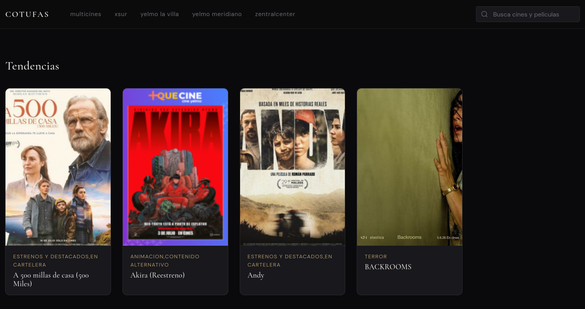
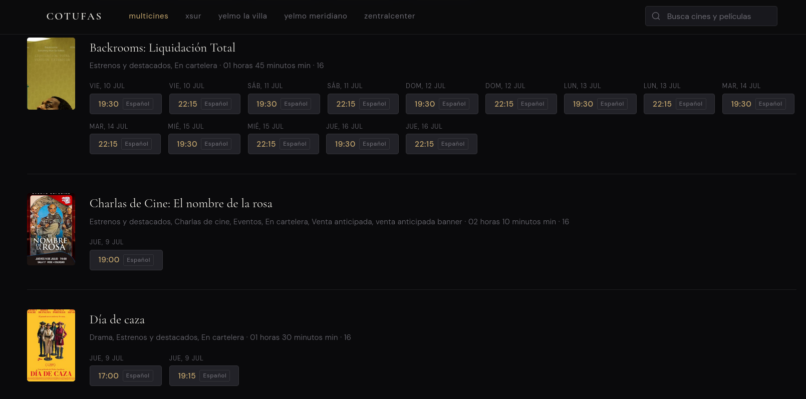
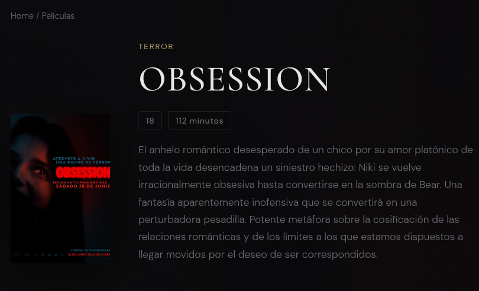
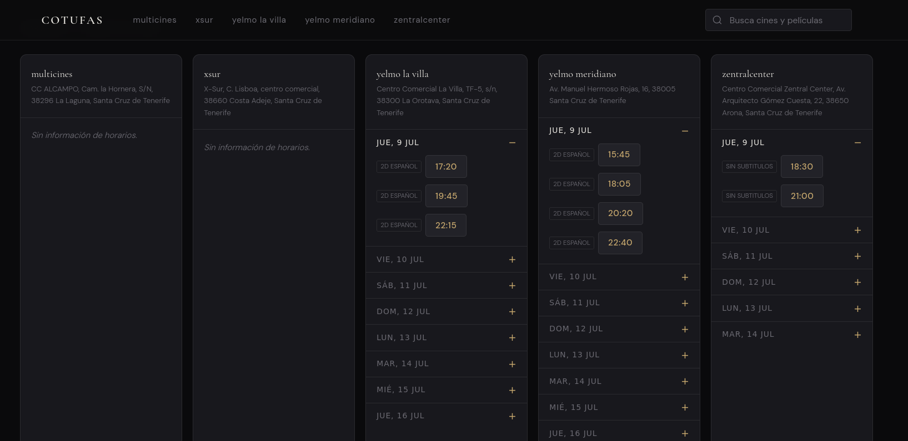

# Cotufas

Aplicación web para consultar la cartelera de los cines principales de la isla de Tenerife.

El proyecto automatiza un proceso ETL de películas y horarios de los 5 cines principales de la isla mediante scraping con **Scrapy + Playwright**, transormación y normalización mediante scrpits de python y almacenaje de la información en **PostgreSQL**. Todo para su exposición mediante una **API REST desarrollada con Django REST Framework y documentada con Swagger**.

El frontend, desarrollado con **Angular**, consume esta API y permite consultar los cines, películas y horarios disponibles, así como acceder directamente a la página del cine para realizar la compra o reserva de entradas.

---

## Imágenes









---

## Características

### Cartelera

* Consulta de **5 cines locales** desde una única aplicación.
* Listado de todas las películas disponibles.
* Información actualizada mediante scraping automatizado.
* Consulta de horarios por película y cine.

### Proceso ETL

* Scraping automatizado utilizando **Scrapy + Playwright**.
* Obtención de información desde las páginas web de los diferentes cines.
* Procesamiento y normalización de los datos antes de almacenarlos.
* Persistencia de películas, cines y sesiones en PostgreSQL.

### API REST

* API desarrollada con **Django REST Framework**.
* Endpoints para consultar:
  * Cines.
  * Películas.
  * Horarios.
  * Sesiones disponibles.
* Documentación interactiva mediante **Swagger / OpenAPI**.

### Frontend

* Aplicación desarrollada con **Angular**.
* Arquitectura basada en componentes.
* Listado de todos los cines.
* Listado de películas.
* Página de detalle de cada película.
* Comparación de horarios entre diferentes cines.
* Redirección al sitio web del cine al seleccionar una sesión.

## Tecnologías

### Backend

* Python
* Django
* Django REST Framework
* Scrapy
* Playwright
* PostgreSQL

### API

* REST
* OpenAPI
* Swagger

### Frontend

* Angular
* TypeScript
* HTML5
* CSS3

## Instalación

### Requisitos

* Python 3.11.5
* Node.js
* npm
* PostgreSQL
* Playwright

### 1. Clonar el repositorio

```bash
git clone <https://github.com/jaimelgc/cotufas-v0>
cd <cotufas-v0>
```

### 2. Configurar el backend

Crear y activar un entorno virtual:

```bash
python -m venv .venv

# Linux / macOS
source .venv/bin/activate

# Windows
.venv\Scripts\activate
```

Instalar dependencias:

```bash
pip install -r requirements.txt
```

Ejecutar las migraciones:

```bash
python manage.py migrate
```

Iniciar el servidor:

```bash
python manage.py runserver
```

---

### 3. Configurar Playwright

```bash
playwright install
```

---

### 4. Ejecutar el proceso etl

```bash
python loader.py
```
---

### 5. Instalar y ejecutar Angular

```bash
cd frontend
npm install
npm start
```

La aplicación estará disponible normalmente en:

```text
http://localhost:4200
```

---
